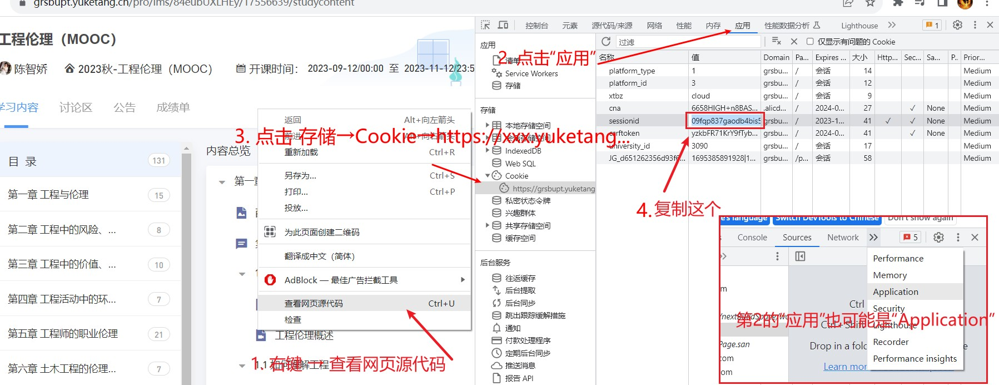

## 项目功能
爬取雨课堂的答案。**注意，需要你先答一遍题，有答案之后才能爬取！**

## 运行方式

### 一、配置Python环境

记得安装好```selenium```

```bash
pip install selenium
pip install tqdm
```

### 二、配置浏览器驱动

本项目默认以Chrome为例，以Windows系统为例。其他浏览器原理类似、其他操作系统原理类似。

首先电脑上要安装有[Chrome浏览器](https://www.google.cn/chrome/index.html)（别装到假的Chrome了，之前有同学装了个假Chrome后来问我为什么程序不能正常运行QAQ）

其次需要下载**对应版本的**```ChromeDriver```：[下载地址1](https://chromedriver.chromium.org/downloads)、[下载地址2](https://googlechromelabs.github.io/chrome-for-testing/)、[下载地址3](https://github.com/LetMeFly666/YuketangAutoPlayer/releases/download/v0.0/chromedriver.exe)、[教程1](https://blog.csdn.net/fighting_jiang/article/details/116298853)、[教程2](https://blog.csdn.net/zhoukeguai/article/details/113247342)、[最后的尝试](https://cn.bing.com/search?q=chromedriver%E4%B8%8B%E8%BD%BD)。（版本相差不大的话也无所谓）

将```ChromeDriver.exe```放到```环境变量```中 或 ```脚本(执行)目录```下。

### 三、设置信息

打开```main.py```，代码头部存在以下信息，需要你自己修改：

```python
IF_HEADLESS = False  # 是否以无窗口模式运行（首次运行建议使用有窗口模式以观察是否符合预期）
COURSE_URL = 'https://grsbupt.yuketang.cn/pro/lms/84eubUXLHEy/17556639/studycontent'  # 要刷的课的地址（获取方式见README）
COOKIE = 'sjfeij2983uyfh84y7498uf98ys8f8u9'  # 打死也不要告诉别人哦（获取方式见README）
```

#### ①IF_HEADLESS

是否以无窗口模式运行。建议以有窗口模式运行（那就不用改这一行了）。

若以无窗口模式运行，则不会弹出Chrome浏览器界面，但视频仍能正常刷取。

#### ②COURSE_URL

你要刷的课的URL。

进入雨课堂，进入你想要获取答案的课程，点击“学习内容”，复制地址栏的url即可。


（注意是https格式的哦）

#### ③COOKIE

**若你觉得COOKIE的获取比较麻烦，你可以选择[跳过这一步](#四开始刷课)并每次重新扫码登录**。扫码登录不支持HEADLESS模式。

COOKIE用来告诉雨课堂你是你。获取方式如下：

登录（你们学校的）雨课堂，```打开开发者工具```（下图的步骤1，也可百度），依次点击“应用→存储→Cookie→ https&#58;&#47;&#47;xxx.yuketang... ”，复制**sessionid**对应的值



### 四、修改Xpath
不同的课程的答案位置不同请按需修改


### 五、修改输出格式
不同的课程的输出格式不同请按需修改，`answer.txt`是一个格式示例。

### 六、运行程序
输入`python main.py`以启动

## 参考项目
https://github.com/LetMeFly666/YuketangAutoPlayer
